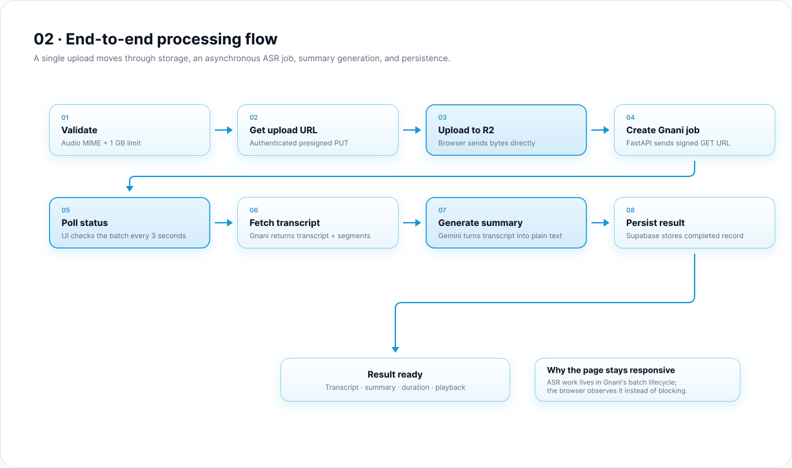
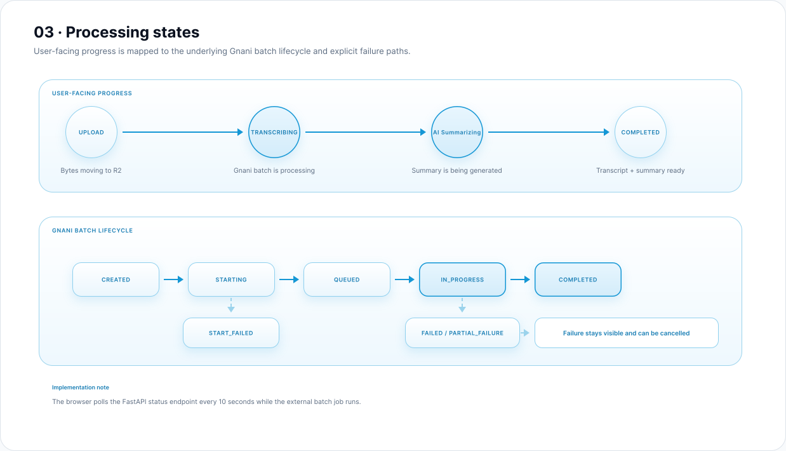

<div align="center">


# AudioNote

**Turn recordings into something you can actually use.**

Upload audio. Get a transcript, a concise summary, and a history you can come back to.

[Live demo](https://gnani-task-one.vercel.app) · [Architecture](https://gnani-task-one.vercel.app/architecture)

</div>

---

## Overview

AudioNote is a full-stack audio notes platform built around one simple flow:

**Upload → Transcribe → Summarize → Revisit**

Recordings go straight from the browser to object storage, are transcribed asynchronously with Gnani Batch STT, summarized with Google Gemini, and saved so they can be reopened at any time.


## Features

- **Direct uploads.** Audio goes from the browser to Cloudflare R2 through a short-lived presigned URL, up to 1 GB per file.
- **Accurate transcription.** Gnani Batch STT handles long recordings as background jobs, with optional cancellation.
- **Multilingual.** English, Hindi, Tamil, Telugu, Kannada, Bengali, Marathi and Gujarati, with summaries written in the selected language.
- **Clear summaries.** Gemini turns the finished transcript into a short plain-text summary.
- **Visible progress.** Upload, transcription and summary stages stay on screen, so long files never look frozen.
- **Honest failures.** Invalid files, upload errors, failed jobs and network problems are surfaced to the user.
- **History.** Completed recordings are stored per user with transcript, summary and audio playback.
- **Secure by default.** Supabase email and Google sign-in, with private audio served through signed URLs.

## How it works

1. The browser validates the file and requests a presigned upload URL.
2. The audio is uploaded directly to **Cloudflare R2**.
3. **FastAPI** creates and starts a **Gnani Batch STT** job from a signed read URL and returns a task ID.
4. The frontend polls the task status and shows the current stage.
5. When transcription completes, the backend fetches the transcript and asks **Gemini** for a summary.
6. The result is saved to **Supabase PostgreSQL** and appears in the user's history.



### Processing states



Large files never pass through the application servers, and no single HTTP request stays open for the length of a transcription job.

## Tech stack

| Layer | Technology |
|---|---|
| Frontend | Next.js 16, React 19, TypeScript, Tailwind CSS |
| UI | Motion, Lucide, custom liquid glass components |
| Backend | FastAPI, Python |
| Speech to text | Gnani Batch STT |
| Summarization | Google Gemini |
| Storage | Cloudflare R2 |
| Database and auth | Supabase PostgreSQL and Supabase Auth |

## Project structure

```text
.
├── frontend/                 Next.js application
│   ├── app/                  Routes: home, transcriptions, about, architecture, auth
│   ├── actions/              Server actions: upload, transcribe, history
│   ├── components/           Interface and UI primitives
│   ├── context/              Upload and processing state
│   ├── lib/                  R2 and Supabase clients
│   └── public/
├── routes/
│   └── transcription.py      Transcription endpoints
├── services/
│   ├── gnani.py              Gnani Batch STT client
│   ├── r2.py                 Signed URL helpers
│   └── summary.py            Gemini summarization
├── images/                   README assets
├── config.py
├── main.py
└── requirements.txt
```

## API

| Method | Endpoint | Description |
|---|---|---|
| `POST` | `/transcribe` | Create and start a transcription job |
| `GET` | `/transcribe/{task_id}` | Get job status, or the finished result |
| `POST` | `/transcribe/{task_id}/cancel` | Cancel a running job |
| `GET` | `/health` | Service health check |

## Getting started

### Prerequisites

- Python 3.11+
- Node.js 20+
- Accounts for Gnani, Google AI Studio, Cloudflare R2 and Supabase

### 1. Clone

```bash
git clone https://github.com/achyantsh/gnani-task.git
cd gnani-task
```

### 2. Backend

```bash
python -m venv .venv
source .venv/bin/activate        # Windows: .venv\Scripts\activate

pip install -r requirements.txt
uvicorn main:app --reload --port 8000
```

### 3. Frontend

```bash
cd frontend
npm install
npm run dev
```

The app runs at `http://localhost:3000`.

### 4. Database

Create a `transcriptions` table in Supabase with these columns:

| Column | Type |
|---|---|
| `id` | `uuid`, primary key |
| `user_id` | `uuid`, references `auth.users` |
| `filename` | `text` |
| `file_key` | `text` |
| `language_code` | `text` |
| `duration_seconds` | `float8` |
| `transcript` | `text` |
| `summary` | `text` |
| `status` | `text` |
| `created_at` | `timestamptz`, default `now()` |

Enable row level security so each user can only read their own rows. Your R2 bucket also needs a CORS rule that allows `PUT` from your frontend origin.

## Environment variables

**Backend** (`.env`)

```env
GNANI_API_KEY=
GEMINI_API_KEY=

CLOUDFLARE_R2_ACCOUNT_ID=
CLOUDFLARE_R2_ACCESS_KEY_ID=
CLOUDFLARE_R2_SECRET_KEY=
CLOUDFLARE_R2_BUCKET_NAME=

SUPABASE_URL=
SUPABASE_SERVICE_ROLE_KEY=

CORS_ORIGINS=http://localhost:3000
```

**Frontend** (`frontend/.env.local`)

```env
NEXT_PUBLIC_SUPABASE_URL=
NEXT_PUBLIC_SUPABASE_PUBLISHABLE_KEY=

FASTAPI_URL=http://localhost:8000

CLOUDFLARE_R2_ACCOUNT_ID=
CLOUDFLARE_R2_ACCESS_KEY_ID=
CLOUDFLARE_R2_SECRET_KEY=
CLOUDFLARE_R2_BUCKET_NAME=
```

Never commit real credentials.

## Deployment

| Service | Platform |
|---|---|
| Frontend | Vercel |
| Backend | Render |
| Storage | Cloudflare R2 |
| Database and auth | Supabase |

Set `FASTAPI_URL` on the frontend to your deployed backend, and add the frontend URL to `CORS_ORIGINS` on the backend.

## Roadmap

- Durable task state in place of in-memory storage
- Queue-backed background workers
- Retries and idempotency for provider calls
- Provider and task observability

## License

Built as a take-home implementation of the Gnani Audio Notes Platform task.
